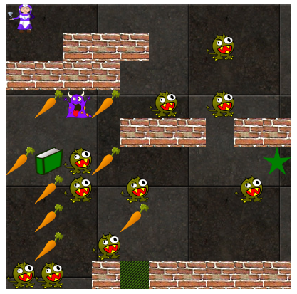

# roguelikeDungeonsCrawlerGame
## Roguelike Dungeons Crawler Game - Free Code Camp Project

[Build a roguelike dungeon crawler games - Freecodecamp](https://www.freecodecamp.org/challenges/build-a-roguelike-dungeon-crawler-game)

## User stories

- [x] I have health, a level, and a weapon. I can pick up a better weapon. I can pick up health items.
- [x] All the items and enemies on the map are arranged at random.
- [x] I can move throughout a map, discovering items.
- [x] I can move anywhere within the map's boundaries, but I can't move through an enemy until I've beaten it.
- [x] Much of the map is hidden. When I take a step, all spaces that are within a certain number of spaces from me are revealed.
- [ ] When I beat an enemy, the enemy goes away and I get XP, which eventually increases my level.
- [ ] When I fight an enemy, we take turns damaging each other until one of us loses. I do damage based off of my level and my weapon. The enemy does damage based off of its level. Damage is somewhat random within a range.
- [ ] When I find and beat the boss, I win.
- [x] The game should be challenging, but theoretically winnable.

## v. alfa 0.3

Es una aproximación **muy preliminar** a la resolución del problema especificado, todavía pendiente.

Cuando se carga la página se ve el nombre del juego, unas breves instrucciones, el marcador, el mapa y el jugador.

El jugador se mueve por el mapa recogiendo alimentos y recursos para luchar con los monstruos.

Las teclas para mover al personaje son: k (arriba), l (derecha), j (abajo) y h (izquierda), como en el editor vim.

Cuando se encuentra con un monstruo se produce un combate.

Para completar el nivel el jugador tiene que llegar a la salida (un recuadro rayado verde y negro).

Al completarse el objetivo o cuando el jugador se queda sin energía se muestra un mensaje de juego terminado.

*Importante*: a veces se genera un mapa en el que no se puede jugar porque o el jugador o la salida están rodeados de paredes. En la situación actual de desarrollo del juego para poder jugar se debe volver a cargar la página hasta obtener un mapa jugable.

#### 2018-03-24

Implementé la oscuridad más allá de unas celdas alrededor del jugador.

Ubiqué un botón para activar/desactivar la oscuridad.

Escribí un método toggleDarkOn() del juego, que es el que se va a llamar cuando se clickee el botón.

Le agregué al estado del juego la propiedad darkOn, un boolean. El juego le pasa al mapa, vía props, el estado de darkOn.

Voy a reescribir la renderización del mapa según se active o no la oscuridad.

Voy a cambiar las teclas de movimiento a "j", "k", "h", "l", para abajo, arriba, izquierda, derecha, como en vim, en vez de 2, 8, 4 y 6.

#### 2018-03-25

Cambié las teclas de movimiento: j abajo, k arriba, h izquierda y l (ele) derecha.

Ya funciona el botón para ver todo el mapa o sólo la parte alrededor del jugador.

Tengo que mejorar el diseño de la página y otras partes como la mecánica del enfrentamiento y cómo ganar el juego, por ejemplo.

Comencé a separar el código en módulos y usar create-react-app. Necesitaba empezar a organizarlo porque se estaba haciendo muy largo. Me parece que no rompí nada en el proceso.

## ¿Qué es un *Roguelike dungeons crawler game*? / What is a RDCG?

Wikipedia entry on [Roguelike](https://en.wikipedia.org/w/index.php?title=Roguelike&oldid=823678549) games

## Resources

- [Random numbers & parseInt](https://www.youtube.com/watch?v=-xAJKmjKCUE) - Beau teaches JavaScript
- [Key Codes](https://www.cambiaresearch.com/articles/15/javascript-char-codes-key-codes)
- [Key Values](https://developer.mozilla.org/es/docs/Web/API/KeyboardEvent/key/Key_Values)
- [Named Key Attribute Values](https://www.w3.org/TR/uievents-key/#named-key-attribute-values)
- [KeyboardEvent Key](https://developer.mozilla.org/en-US/docs/Web/API/KeyboardEvent/key)
- [KeyboardEvent](https://developer.mozilla.org/en-US/docs/Web/API/KeyboardEvent)
- [Handling events in React](https://reactjs.org/docs/handling-events.html)
- [Keyboard-events - React](https://reactjs.org/docs/events.html#keyboard-events)
- [forum.freecodecamp.org - Let's discuss your roguelike dungeon crawler game - Question from JordanSobovitch, answer by miwst](https://forum.freecodecamp.org/t/lets-discuss-your-roguelike-dungeon-crawler-game/6186/55)
- [Wind-mage, monsters, food and book images](https://openclipart.org/)
- [Tiles and wall textures](http://download.tuxfamily.org/freegamearts/image/textures/trak2-textures.zip)
- [Pure CSS Images](https://medium.com/coding-artist/a-beginners-guide-to-pure-css-images-ef9a5d069dd2)
- [setInterval and setTimeout: timing events](https://www.youtube.com/watch?v=kOcFZV3c75I) - Beau teaches JavaScript. Usé setInterval para una primera versión del juego que implementé sin React.
